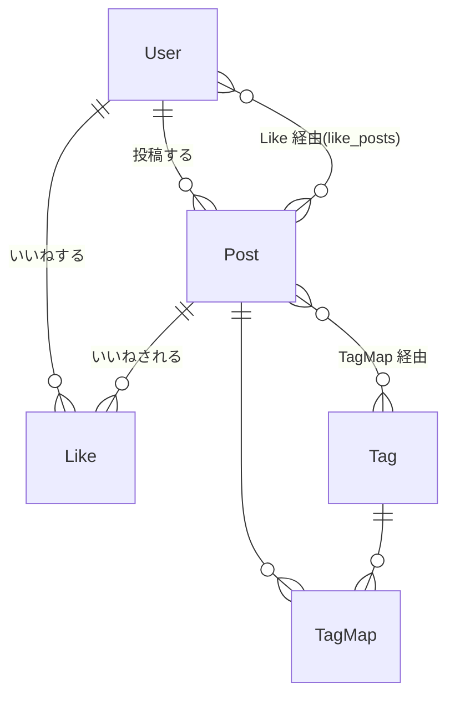
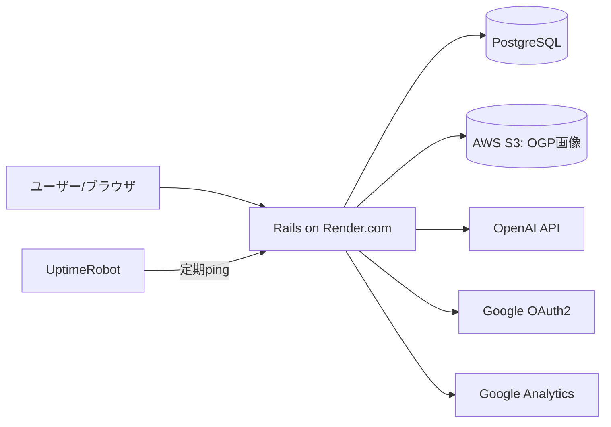

# アーキテクチャ・設計ドキュメント

> **用途**: Claude（ハル）が aruaru-game を触るときに読む**グラウンディング資料**。
> ここに書かれた事実・ルールを作業の基準にする。人間向けの解説は [README](../README.md)。
> より粒度の細かい参照は [domain-models.md](domain-models.md) / [endpoints.md](endpoints.md) / [conventions.md](conventions.md)、
> 環境・コマンドは [development.md](development.md)。

「あるある神経衰弱：界隈探求ゲーム」の技術構成と設計の俯瞰。

## サービス概要
ユーザーが投稿した「界隈あるある」5 つをカードにして**神経衰弱**として遊べるサービス。
メジャーからニッチまであらゆるカルチャーの `あるある` を、ゆかりの有無に関わらず知り・X で交流できる。
コミュニケーションのきっかけ作りを目的とする。

## 技術スタック
| カテゴリ | 技術 |
|---|---|
| バックエンド | Rails 7.2.3.2 / Ruby 3.2.3 |
| DB | PostgreSQL |
| フロント | esbuild(jsbundling) + Stimulus + Turbo、TailwindCSS + DaisyUI(cssbundling) |
| 認証 | Devise + OmniAuth（Google OAuth2） |
| 画像 | CarrierWave + MiniMagick（動的 OGP 生成）、保存先 AWS S3（fog-aws） |
| 外部 API | OpenAI（あるある生成）|
| 検索 | Ransack |
| インフラ | Render.com / AWS S3、スリープ対策 Uptime Robot、計測 Google Analytics |
| 開発環境 | Docker Compose |

> 注: README の技術スタック表は Rails 7.1.3 表記だが、実際のコードは **7.2.3.2**（Gemfile / Gemfile.lock）。

## ドメインモデル

- **User**: Devise（`database_authenticatable`, `omniauthable`: google_oauth2）。`name`（必須・一意）、`uid`（provider スコープで一意）。
  - `from_omniauth` で Google ログインを処理。既存メールユーザー発見時は provider/uid を紐付ける（アカウント分裂防止）。
  - `like` / `unlike` / `like?` を持つ。
- **Post**: `title`（＝界隈名）と `aruaru_one`〜`aruaru_five`（各必須・最大 40 文字）。`belongs_to :user`。
  - 動的 OGP を CarrierWave（`PostOgpUploader`）でマウント。Ransack 許可属性は `title` のみ。
  - `save_tags`（文字列をスペース/句読点で分割してタグ付け）、`exclude_open_ai_answer` スコープ。
  - `find_or_create_from_openai` で AI 生成投稿を扱う（後述）。
- **Tag** / **TagMap**: Post ↔ Tag の多対多。Tag に `with_posts` / `posted_by(user)` スコープ
  （投稿の無い「みなしごタグ」を一覧から除外）。
- **Like**: `belongs_to :user, :post`。`user_id`×`post_id` で一意。

### 特別ユーザー `OPEN_AI_ANSWER`
AI が生成した投稿の所有者として、名前 `OPEN_AI_ANSWER` のユーザーを使う。
一覧・検索ではこのユーザーの投稿を除外し、ユーザー投稿と区別する。

## 画面・ルーティング（主なもの）
| 目的 | ルート | コントローラ |
|---|---|---|
| トップ | `/` | `tops#toppage` |
| 投稿一覧（界隈一覧） | `/posts` | `posts#index` |
| 自作あるある一覧 | `/posts/myindex` | `posts#myindex`（要ログイン） |
| 投稿 CRUD | `/posts` | `posts#new/create/edit/update/destroy` |
| 神経衰弱ゲーム | `/games/:id/start` | `games#start` |
| AI 生成 | `POST /openai_posts/answer` | `openai_posts#answer` |
| タグ一覧 / 自分のタグ | `/tags`, `/tags/myindex` | `tags#index/myindex` |
| タグ別 | `/tags/:id` | `tags#show` |
| 検索 / 補完 | `/search_posts/search`, `/autocomplete` | `search_posts` |
| お気に入り | `/likes` | `likes#index/create/destroy`（要ログイン） |
| 動的 OGP 画像 | `/images/ogp.png` | `images#ogp` |
| 認証 | Devise + `users/omniauth_callbacks`, `users/registrations` |

- 未ログイン時に必要なアクションは `custom_authenticate_user!`（`ApplicationController`）で root へ誘導。
- 存在しない URL/ID は 404 ではなく **投稿一覧へリダイレクト + フラッシュメッセージ**（`handle_404`）。遊びを継続させる意図。

## 主要機能の仕組み
- **神経衰弱ゲーム**: `games#start` が対象 Post を取得しカード面に `aruaru_one`〜five を表示。ペア成立で文字色変化（フロント/Stimulus）。
- **AI 界隈あるある生成**: `OpenaiService`（`app/services`）が OpenAI へ界隈名を送り、関西弁で 5 つの `あるある` を生成。
  `Post.find_or_create_from_openai` が Rails.cache でキャッシュしつつ `OPEN_AI_ANSWER` ユーザーの投稿として保持。**1 ブラウザ 1 日 1 回**（Cookie 判定、後述）。
- **動的 OGP**: `OgpCreator`（`app/controllers/concerns`）が MiniMagick でベース画像にユーザー名・界隈名を描画。生成画像を S3 に保存し、meta タグに設定。X 拡散を意図しカードにモザイク。
- **X シェア / タグ**: 界隈名をハッシュタグ化（`:` 等は除外）。共通タグ `#あるある神経衰弱`。`save_tags` はスペース・読点・句点等で分割。
- **検索 / オートコンプリート**: Ransack（`title_cont`）で検索。`search_posts#autocomplete` はひらがな/カタカナ相互変換も考慮し候補を JSON で返す（`OPEN_AI_ANSWER` は除外）。
- **お気に入り**: `likes`（Turbo Stream）で登録/解除。`/likes` で一覧。

## セキュリティ設計
- **AI 生成の 1 日 1 回制限**: OpenAI をレスポンス数制限内に収めるため、生成したブラウザに Cookie（当日日付）を付与し `tops#today_or_another` で「今日生成済みか」を判定。DB を圧迫しないよう AI 投稿は永続化しすぎない方針。
  - Cookie は `httponly: true`（XSS 対策）/ `same_site: :lax`（CSRF 対策）/ 本番のみ `secure`。
- **CSRF / XSS**: Rails 標準の `protect_from_forgery` とサニタイズ。OmniAuth コールバックのみ CSRF トークン検証をスキップ。
- **エラーハンドリング**: 不正な URL/ID は `handle_404` で一覧へ誘導しメッセージ表示（404 ページに飛ばさない）。
- **CI**: GitHub Actions で RSpec / RuboCop を自動実行。依存脆弱性は Dependabot + bundler-audit。

## 外部連携図（構成）

## 参考
- Qiita 解説記事: https://qiita.com/pakira-56A/items/8fde551e0e14520d6f3c
- 画面遷移図 / ER 図は README 末尾のリンク（Figma / dbdiagram.io）を参照。
