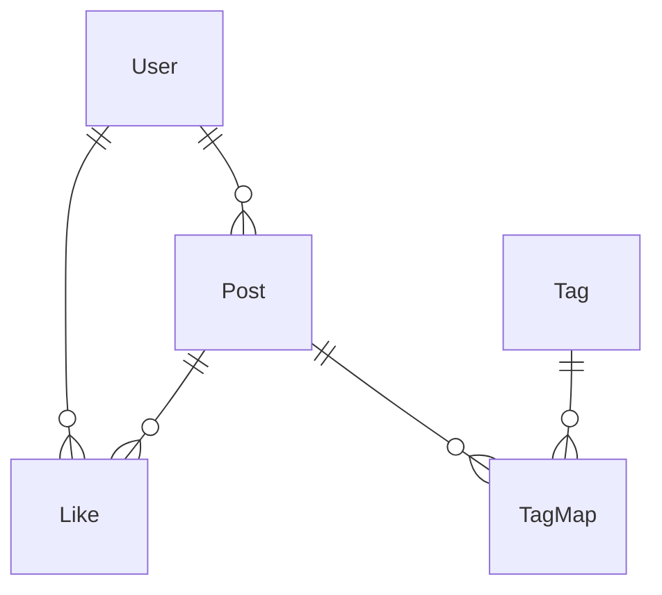

# ドメインモデル参照（エージェント用）

各モデルの事実（フィールド・バリデーション・関連・スコープ・主要メソッド）とビジネスルール。
コードは `app/models/`。変更時はここも更新する。

## User (`app/models/user.rb`)
- Devise: `database_authenticatable`, `omniauthable`（provider: `google_oauth2`）。
- バリデーション: `name` 必須・一意（大小無視）。`uid` は `provider` スコープで一意（uid present 時のみ）。
- 関連: `has_many :posts, :likes`。`has_many :like_posts, through: :likes, source: :post`。
- メソッド:
  - `self.from_omniauth(auth)`: provider+uid で検索 → 無ければ email で既存ユーザー検索 → それも無ければ新規作成。
    **既存 email ユーザー発見時は `provider`/`uid` を update して紐付ける**（アカウント分裂防止 / PR #435）。
  - `like(post)` / `unlike(post)` / `like?(post)`。

## Post (`app/models/post.rb`)
- フィールド: `title`（＝界隈名）、`aruaru_one`〜`aruaru_five`。
- バリデーション: 全て presence、**最大 40 文字**。
- 関連: `belongs_to :user`、`has_many :tag_maps/:tags(through)/:likes`。
- 画像: `mount_uploader :ogp, PostOgpUploader`（動的 OGP）。
- 検索: `ransackable_attributes` は **`title` のみ**（Ransack で他カラムは検索不可）。
- スコープ: `exclude_open_ai_answer`（`OPEN_AI_ANSWER` ユーザーの投稿を除外）。
- メソッド:
  - `save_tags(tags)`: 文字列を空白・`、`・`。`・`,`・`.` で分割し uniq。差分だけ Tag を付け外し。
  - `self.find_or_create_from_openai(question)`: `Rails.cache` を見て無ければ `OpenaiService.get_response` → 5 つに整形し
    `OPEN_AI_ANSWER` ユーザーの投稿として `create`。生成不可なら `nil`。

## Tag (`app/models/tag.rb`) / TagMap (`app/models/tag_map.rb`)
- Tag: `has_many :tag_maps/:posts(through)`。スコープ:
  - `with_posts`（投稿が 1 件以上あるタグ）、`posted_by(user)`（指定ユーザーが投稿したタグ）。
  - → 投稿削除後に残る「みなしごタグ」を一覧から除外するためのもの（PR #433）。
- TagMap: `belongs_to :post, :tag`。`post_id` / `tag_id` presence。

## Like (`app/models/like.rb`)
- `belongs_to :user, :post`。`user_id` は `post_id` スコープで一意（二重いいね不可）。

## 特別ユーザー `OPEN_AI_ANSWER`
- AI 生成投稿の所有者。名前が `OPEN_AI_ANSWER` の User。
- **一覧・検索・オートコンプリートでは常に除外**してユーザー投稿と区別する。
- テストでは factory trait `create(:user, :open_ai_answer)` を使う。

## ER

## Uploader (`app/uploaders/post_ogp_uploader.rb`)
- 本番: `storage :fog`（AWS S3 / fog-aws）。開発・テスト: `storage :file`（ローカル）。
